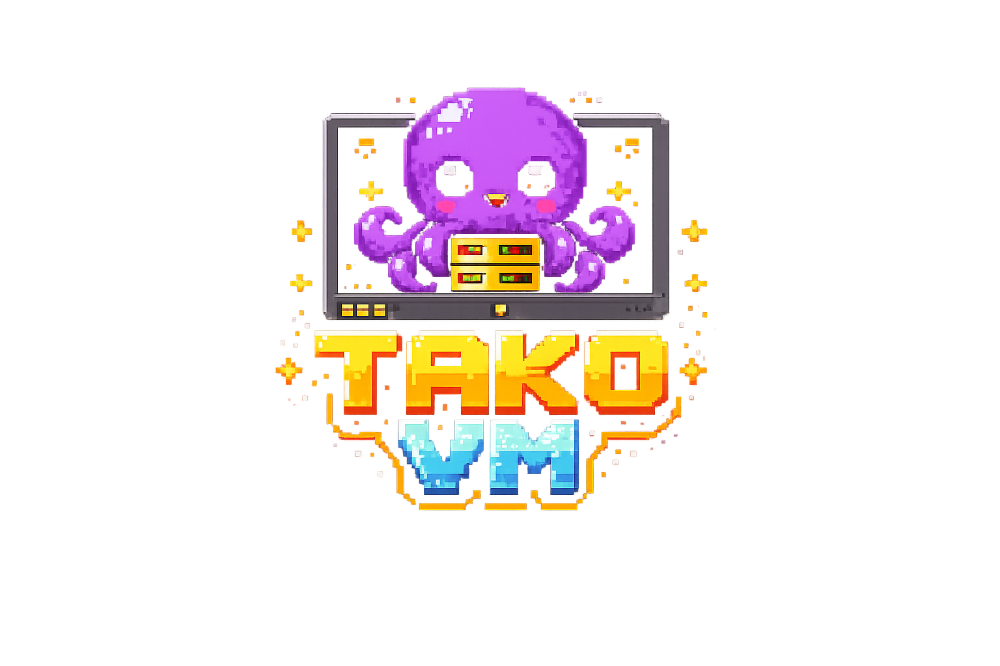

<p align="center">
  
</p>

<p align="center">
  <strong>信頼できない Python コードを安全に実行。ジョブキューと Docker による隔離を標準搭載。エンタープライズでの採用実績あり。</strong>
</p>

<p align="center">
  <a href="https://pypi.org/project/tako-vm/"></a>
  <a href="https://github.com/las7/TakoVM/actions"></a>
  <a href="https://github.com/las7/TakoVM/blob/main/LICENSE"></a>
</p>

<p align="center">
  <a href="README.md">English</a> | <strong>日本語</strong>
</p>

AI が生成したコードを、隔離された Docker コンテナ内で実行します。必要に応じて gVisor によるサンドボックス化にも対応可能です。ジョブキュー・リトライ・実行履歴を標準で搭載しています。

<p align="center">
  <a href="https://las7.github.io/TakoVM/"><strong>ドキュメント</strong></a> · <a href="https://las7.github.io/TakoVM/getting-started/quickstart/"><strong>クイックスタート</strong></a> · <a href="https://las7.github.io/TakoVM/api/rest/"><strong>API リファレンス</strong></a>
</p>

```bash
# インストール（Docker と Python 3.10 以上が必要）
pip install "tako-vm[server]"
tako-vm setup                   # 実行用 Docker イメージを取得
tako-vm server                  # サーバーを起動（Docker 経由で PostgreSQL を自動起動）
```

```bash
# コードを実行
curl -X POST http://localhost:8000/execute \
  -H "Content-Type: application/json" \
  -d '{"code": "print(1 + 1)"}'
```

## なぜ Tako VM なのか

[e2b](https://e2b.dev)、[daytona](https://daytona.dev)、[microsandbox](https://github.com/microsandbox/microsandbox) などのサンドボックス製品が提供してくれるのは、隔離されたコード実行だけです。実際のアプリケーションでは、以下の機能を自前で用意する必要があります。

| 自前で構築が必要なもの | サンドボックスのみの場合 | Tako VM の場合 |
|-----------|-------------------|--------------|
| ジョブキュー | Redis + Celery/Bull | 標準搭載 |
| 実行履歴 | Postgres + スキーマ設計 | PostgreSQL 同梱 |
| リトライ処理 | 独自実装 | 自動 |
| 冪等性 | 重複排除ロジック | `idempotency_key` |
| リプレイ／デバッグ | 独自ツール | 再実行／フォーク API |

**Tako VM は、これらをすべて備えたオールインワンのパッケージです。**

- **ジョブキュー + ワーカー**：ワーカープールで非同期に実行します。Redis や Celery のセットアップは不要です
- **実行履歴**：すべてのジョブを stdout・stderr・実行時間・成果物とともに保存します
- **リプレイによるデバッグ**：過去のジョブを同じコードと入力で再実行できます
- **Docker による隔離**：各ジョブを seccomp フィルタリング付きの専用コンテナで実行します
- **ネットワーク隔離**：デフォルトでネットワークを遮断し、ジョブタイプごとに許可リストを設定できます
- **セルフホスト**：自分のマシンで動作します。オフラインでも使え、実行ごとのコストはかかりません

## CLI

```bash
tako-vm setup                     # 実行用イメージを取得し、Docker を検証
tako-vm server                    # API サーバーを起動
tako-vm server --port 9000        # ポートを指定
tako-vm dev up                    # 開発用のローカル PostgreSQL を起動
tako-vm dev up --with-server      # PostgreSQL + API サーバーを起動
tako-vm dev status                # ローカル PostgreSQL の状態を確認
tako-vm dev down                  # ローカル PostgreSQL を停止
tako-vm config                    # 現在の設定を表示
tako-vm config --json             # JSON 形式で出力
tako-vm validate                  # 現在の設定を検証
tako-vm validate my.yaml          # 指定したファイルを検証
tako-vm status                    # サーバーの稼働状態を確認
tako-vm version                   # バージョンを表示
tako-vm --config my.yaml server   # 指定した設定ファイルを使用
```

## ドキュメント

| トピック | リンク |
|-------|------|
| インストール | [docs/getting-started/installation.md](docs/getting-started/installation.md) |
| クイックスタート | [docs/getting-started/quickstart.md](docs/getting-started/quickstart.md) |
| 設定 | [docs/getting-started/configuration.md](docs/getting-started/configuration.md) |
| REST API | [docs/api/rest.md](docs/api/rest.md) |
| Python SDK | [docs/api/sdk.md](docs/api/sdk.md) |
| ジョブタイプと環境 | [docs/guide/environments.md](docs/guide/environments.md) |
| セキュリティ | [docs/deployment/security.md](docs/deployment/security.md) |
| デプロイ | [docs/deployment/how-to-deploy.md](docs/deployment/how-to-deploy.md) |
| 設定リファレンス | [tako_vm.yaml.example](tako_vm.yaml.example) |

## ライセンス

Apache License 2.0
