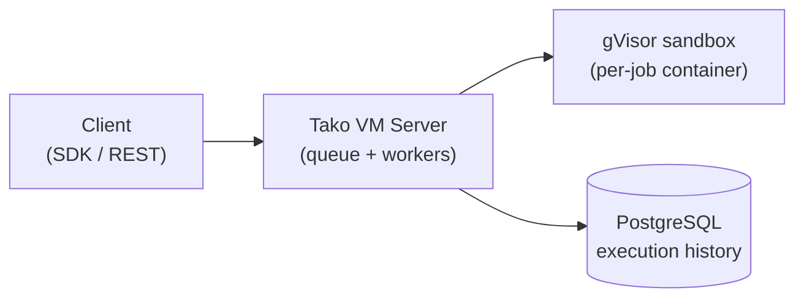

<div class="tako-hero" markdown>

# Tako VM

<p class="tako-tagline"><strong>A secure file system for your agents to execute code.</strong><br>
File system and Python execution for your agents — run untrusted code in gVisor-isolated containers, with the queue, workers, execution history, retries, and replay you'd otherwise build yourself.</p>

<div class="tako-badges" markdown>
[](https://pypi.org/project/tako-vm/)
[](https://pypi.org/project/tako-vm/)
[](https://github.com/Tako-Research/TakoVM/blob/main/LICENSE)
[](https://github.com/Tako-Research/TakoVM/actions)
</div>

[Get started](getting-started/quickstart.md){ .md-button .md-button--primary }
[View on GitHub](https://github.com/Tako-Research/TakoVM){ .md-button }

</div>

## Run your first job in two minutes

```bash
pip install "tako-vm[server]"
tako-vm setup                   # pull the executor Docker image
tako-vm server                  # start server (auto-starts PostgreSQL via Docker)
```

=== "Python SDK"

    ```python
    from tako_vm import Sandbox

    with Sandbox() as sb:
        result = sb.run("print(1 + 1)")
        print(result.stdout)  # "2"
    ```

=== "REST API"

    ```bash
    curl -X POST http://localhost:8000/execute \
      -H "Content-Type: application/json" \
      -d '{"code": "print(1 + 1)"}'
    ```

=== "Async jobs"

    ```python
    import tako_vm

    tako_vm.configure("http://localhost:8000")

    job_id = tako_vm.submit_code("print(sum(i * i for i in range(10**6)))")
    result = tako_vm.get_result(job_id, timeout=60)
    print(result["stdout"])
    ```

<div class="grid cards" markdown>

- :material-clock-fast:{ .lg .middle } **Quick start**

    ---

    Install, run the server, and execute your first sandboxed job.

    [:octicons-arrow-right-24: Getting started](getting-started/quickstart.md)

- :material-shield-lock:{ .lg .middle } **Security model**

    ---

    gVisor isolation, seccomp, the threat model, and how to harden for production.

    [:octicons-arrow-right-24: Security](security/index.md)

- :material-robot:{ .lg .middle } **Agent integration**

    ---

    Wire Tako VM into LangChain or OpenAI tool-calling as a code-execution tool.

    [:octicons-arrow-right-24: Agent guide](guide/agent-tools.md)

- :material-api:{ .lg .middle } **API reference**

    ---

    Every endpoint and SDK method: sync execution, async jobs, replay, artifacts.

    [:octicons-arrow-right-24: REST API](api/rest.md) · [:octicons-arrow-right-24: Python SDK](api/sdk.md)

</div>

## Why Tako VM?

Sandbox-only tools (e2b, microsandbox) give you isolated execution. You still need to build the job system yourself.

| Feature | Sandbox-only | Tako VM |
|---------|--------------|---------|
| Job queue | Build with Redis/Celery | Built-in |
| Execution history | Build with Postgres | PostgreSQL included |
| Retries | Write retry logic | Automatic |
| Replay/debugging | Build custom tooling | Rerun/fork API |
| Idempotency | Implement deduplication | `idempotency_key` |

- **Job queue + workers** — no Redis/Celery setup needed
- **Execution history** — every job persisted with timing and artifacts
- **Replay to debug** — rerun past jobs with exact same inputs
- **gVisor isolation** — userspace-kernel syscall interception (`runsc`), seccomp filtering, no network by default
- **Self-hosted** — zero per-execution cost, works offline

## Security model

Tako VM exists to run untrusted, often AI-generated, code — so isolation is layered: each job runs in its own ephemeral Docker container behind [gVisor](https://gvisor.dev)'s userspace kernel, with a default-deny seccomp profile, no network, dropped capabilities, and a non-root user. Even a kernel exploit stays inside the sandbox.

For production with untrusted code, set `security_mode: strict` so execution **fails rather than silently falling back** to standard `runc` when gVisor is unavailable.

[:octicons-arrow-right-24: Read the threat model](security/honest-assessment.md){ .md-button }

## How it works



Three core concepts:

- **Sandbox** — a gVisor-backed, single-use container that executes one job and is destroyed.
- **Job** — an asynchronous unit of work with a persisted `ExecutionRecord` lifecycle (`queued → running → succeeded/failed/timeout/oom/cancelled`).
- **Executor image** — the container image jobs run in; runtime `requirements` can be installed per-job via `uv` (opt-in: `allow_runtime_requirements`), with an optional shared cache (`enable_runtime_dependency_cache`) to speed up repeat installs.

!!! note "Where Tako VM is headed"
    The direction is a **serverless filesystem for agents**: durable, per-agent workspaces that persist and rehydrate across runs, spinning up on demand and scaling to zero with state preserved. Today each container is single-use; persistent workspaces are on the roadmap. gVisor remains the sole isolation boundary.

## Next steps

- [Installation](getting-started/installation.md) — set up Tako VM
- [Quick Start](getting-started/quickstart.md) — run your first code
- [Agent Integration](guide/agent-tools.md) — use Tako VM as an agent tool
- [Architecture](architecture.md) — how Tako VM works
- [Changelog](changelog.md) — what's new in each release
